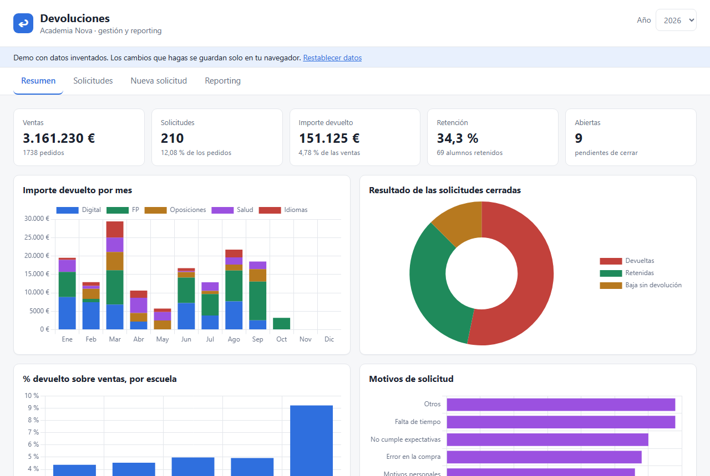
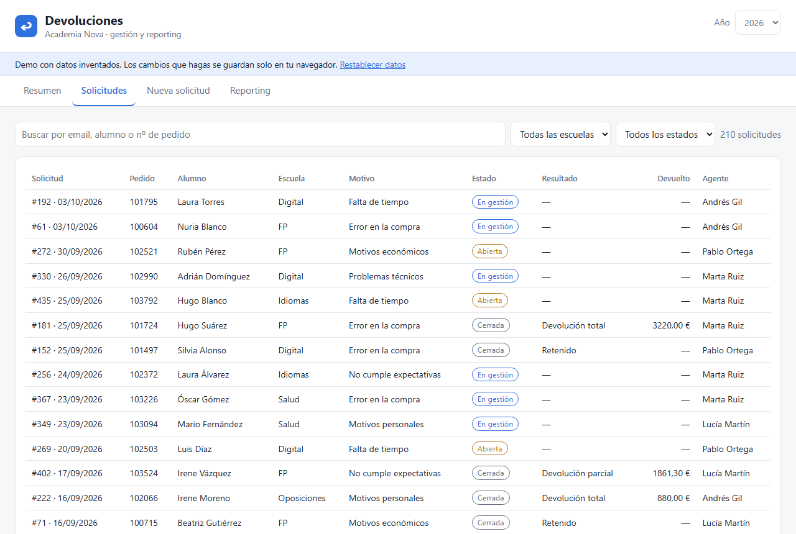
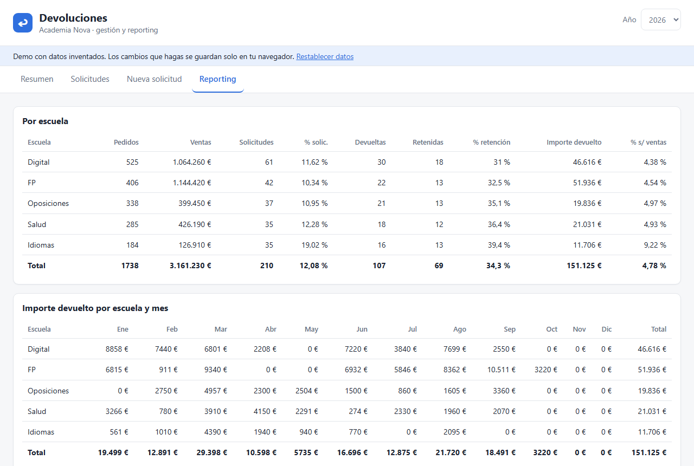

# Devoluciones · demo

Herramienta web para **gestionar solicitudes de devolución** de una academia online y ver su **impacto económico**.
Es una versión de demostración, reescrita desde cero, de una herramienta interna en la que trabajé.
**Todos los datos son inventados** (la academia "Academia Nova", los alumnos y los emails `@example.com`).

**▶ Pruébala en vivo: <https://richiespa-ai.github.io/devoluciones-demo/>**



| Solicitudes | Reporting |
|---|---|
|  |  |

## Qué hace

- **Resumen**: indicadores del año (ventas, solicitudes, importe devuelto, % de retención) y cuatro gráficas.
- **Solicitudes**: tabla con búsqueda y filtros. Al pulsar una fila se edita: estado, resultado, importe devuelto…
- **Nueva solicitud**: al escribir el nº de pedido o el email del alumno, los datos del pedido se rellenan solos.
  Si el alumno tiene varios pedidos, eliges cuál.
- **Reporting**: tabla por escuela y por mes, con totales.

Reglas de negocio que aplica la API (no solo el formulario):

- Un pedido no puede tener dos solicitudes abiertas a la vez.
- Para cerrar una solicitud hay que indicar el resultado.
- "Devolución total" usa el importe del pedido; "Devolución parcial" exige un importe entre 0 y el total.
- La fecha de reembolso se pone sola al registrar una devolución y se borra si se cambia a "Retenido".

## Tecnologías

| Parte | Qué uso | Por qué |
|---|---|---|
| Backend | Python + **FastAPI** | Crea una API REST con validación automática y documentación en `/docs` |
| Base de datos | **SQLite** | Un único archivo, sin servidor aparte: ideal para una demo |
| Frontend | HTML, CSS y JavaScript sin frameworks + **Chart.js** | Ligero y fácil de explicar |
| Tests | **pytest** | Comprueban las reglas de negocio y que el reporting cuadra |
| Despliegue | **Docker** | La misma imagen funciona en cualquier servicio que acepte contenedores |

```
Navegador ──(fetch /api/...)──▶ FastAPI ──(SQL)──▶ SQLite (data/demo.db)
    ▲                              │
    └──── HTML/CSS/JS (static/) ◀──┘
```

## Dos formas de ejecutarla

- **Completa (local o Docker)**: el navegador habla con la API de FastAPI y los datos viven en SQLite.
- **Versión en vivo (GitHub Pages)**: GitHub Pages solo sirve archivos, no ejecuta Python. Por eso
  `scripts/build_static.py` exporta los datos a un archivo y `static/mock-api.js` imita la API en el navegador,
  con las mismas reglas de negocio. Los cambios de cada visitante se guardan solo en su navegador.
  Un flujo de GitHub Actions pasa los tests y publica esta versión en cada push a `main`.

## Estructura

```
app/
  main.py       API: endpoints, validación y reglas de negocio
  db.py         Conexión y tablas de SQLite
  catalogos.py  Listas cerradas (escuelas, motivos, estados…)
  seed.py       Genera los datos inventados
static/         Web: index.html, styles.css, app.js (+ mock-api.js para la versión sin servidor)
scripts/        build_static.py: genera la versión para GitHub Pages
tests/          Tests de la API
.github/        Flujo de tests y publicación automática
```

## Cómo arrancarla en local (Windows, PowerShell)

```powershell
python -m venv .venv
.venv\Scripts\Activate.ps1
pip install -r requirements-dev.txt
uvicorn app.main:app --reload
```

Abre <http://127.0.0.1:8000>. La primera vez se crea `data/demo.db` con unos 4.000 pedidos y 450 solicitudes.
Para volver a los datos iniciales: `python -m app.seed`.

Tests: `pytest`

Documentación interactiva de la API: <http://127.0.0.1:8000/docs>

## API

| Método y ruta | Qué hace |
|---|---|
| `GET /api/pedidos/{np}` | Datos de un pedido |
| `GET /api/pedidos?email=` | Pedidos de un alumno (máx. 20) |
| `GET /api/solicitudes?year=&escuela=&estado=&q=` | Lista de solicitudes con filtros |
| `POST /api/solicitudes` | Crea una solicitud |
| `PATCH /api/solicitudes/{id}` | Cambia estado, resultado, importe… |
| `GET /api/reporting?year=` | Indicadores por escuela y mes |
| `GET /api/catalogos`, `/api/years`, `/api/health` | Listas, años con datos y comprobación de vida |

## Seguridad

- Todas las consultas SQL usan parámetros (`?`), nunca texto pegado: evita la inyección SQL.
- La API valida cada campo contra listas cerradas y limita la longitud de los textos.
- El frontend pinta los datos con `textContent`, nunca con `innerHTML`: evita que un texto se ejecute como código.
- Cabeceras de seguridad (Content-Security-Policy, X-Frame-Options…) y contenedor con usuario sin privilegios.
- No hay claves ni contraseñas: no las necesita. Es una demo sin login: en la versión en vivo cada visitante solo cambia su copia local de los datos.
